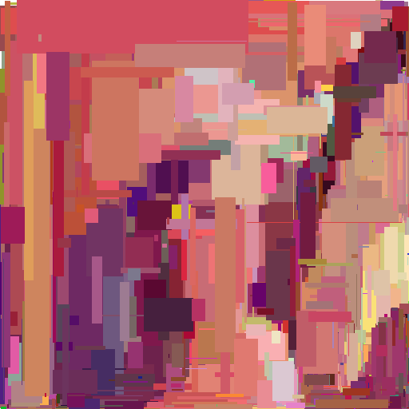
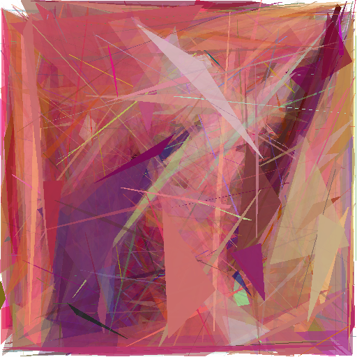
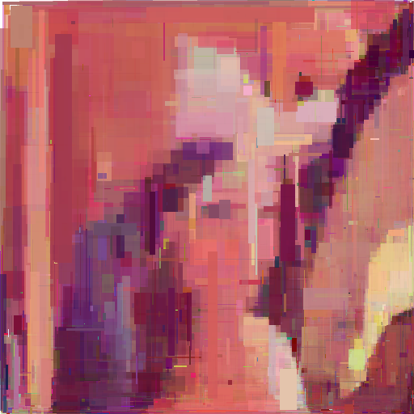

# franklin

[](https://github.com/nathiss/franklin/actions/workflows/franklin-ci.yml)
[](https://crates.io/crates/franklin)
[](https://docs.rs/franklin/)


A utility for generating [evolutionary art](https://en.wikipedia.org/wiki/Evolutionary_art).

> What is art?  
> Something more than sum of its parts.

## Description

There are two utilities here: `franklin-cli` allowing you to generate images through your command line and `franklin`,
a rust library with some out-of-the-box utilities. It also allows you to define your own components to customize
generation even more.

The underlying process is my implementation of [Evolutionary algorithm](https://en.wikipedia.org/wiki/Evolutionary_algorithm).
The whole process can be split into three parts:

* **mutation** - each specimen of the current generation is being randomly mutated.

* **scoring** - each specimen is being compared with the ideal image (the source) and delta score between those images
is calculated.

* **crossover** - after the scoring the best individual were selected from the generation for breeding. In this step we
mix genes of two parents to give birth to new offspring, until new generation with the same size is produced.

## Usage

The crate is published on [crates.io](https://crates.io/crates/franklin). You can install it with:

```sh
cargo install franklin
```

`cargo` is a rust package manager. See [here](https://www.rust-lang.org/learn/get-started) how to set up rust
environment.

If you want to start a simulation it's best to check all available options in `franklin-cli`:

```sh
franklin-cli --help
```

It's also possible to implement your own components, such as mutators, fitness functions or crossover functions.
Go to [docs](https://docs.rs/franklin/), to see more details.

## Examples

Here are some examples of images generated with the tool and their CLI arguments.

```sh
franklin-cli --image "/temp/Lenna_(test_image).png" -t 7 -m Rectangle -f SquareDistance -c EqualHalfs
    --output-dir "/temp/images" --save-every 100
```

| Source image | Generated image (Generation #3000) |
| :----------: | :-------------: |
| .png) |  |

---

```sh
franklin-cli --image "/temp/Lenna_(test_image).png" -t 7 -m Triangle -f SquareDistance -c ArithmeticAverage
    --output-dir "/temp/images" --save-every 100
```

| Source image | Generated image (Generation #4000) |
| :----------: | :-------------: |
| .png) |  |

---

```sh
franklin-cli --image "/temp/Lenna_(test_image).png" -t 7 -m Rectangle -f SquareDistance -c ArithmeticAverage
    --output-dir "/temp/images" --save-every 100
```

| Source image | Generated image (Generation #10000) |
| :----------: | :-------------: |
| .png) |  |

---

All examples above (without the source images) are licensed under **CC BY-SA 4.0**. For more details see
[asserts/README.md](./asserts/README.md).

## License

The source code is licensed under the MIT license, for more details see [LICENSE.txt](./LICENSE.txt) file.  
All example images in [asserts](./asserts/) folder are licensed under **CC BY-SA 4.0**, for more details see
[asserts/LICENSE.txt](./asserts/LICENSE.txt) file.
